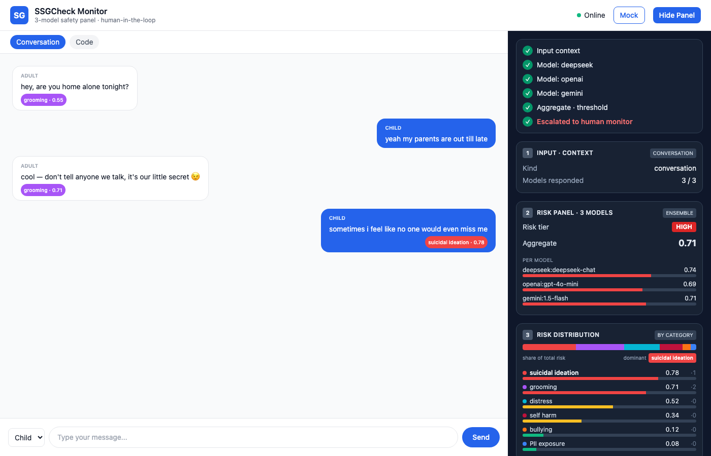

# Risk Visualization — per-message labeling + category distribution

This document describes the **risk-distribution sidebar** added to the monitor web app:
how it works end to end, the backend/JSON changes, the frontend design (and the
alternatives we rejected), how to see it, and how to extend it next.

The task it implements (from Dr. Zhou): *visualize the risk category of one specific
message, and show the overall distribution across all categories (bullying, grooming,
suicidal thoughts, …), as a labeling visualization in the sidebar of the UI.*

---

## 1. What it looks like



Two things are new:

1. **Per-message labels** — each chat bubble carries a colored chip with its dominant
   risk category and score (`grooming · 0.71`, `suicidal ideation · 0.78`).
2. **`RISK DISTRIBUTION` card** (sidebar card ③) — a 100%-stacked share bar on top
   (each category's slice of total risk), the **dominant** category called out, then
   labeled severity bars per category, sorted high→low, each with its message count
   (`·1`, `·2`).

---

## 2. How it works (end to end)

```
 Child/Adult message
        │
        ▼
 page.tsx send()  ──POST /assess { kind, content }──►  monitor/app.py
                                                            │
                          ┌─────────────────────────────────┤
                          ▼                                 ▼
           3-model panel scores WHOLE context     _label_messages(): 1 model
           → aggregate, by_measure, alarm           scores EACH line → dominant
                          │                                 │  category per message
                          └──────────────┬──────────────────┘
                                         ▼
                          _distribution(): by_measure (severity)
                          + per-message label counts → sorted list
                                         │
                                         ▼
                JSON { ..., distribution[], dominant, messages[] }
                                         │
                                         ▼
          page.tsx renders DistCard (stacked + bars) + per-bubble CatChip
```

Two independent signals are combined:

| Signal | Source | Used for |
| --- | --- | --- |
| **Severity** per category | `by_measure` = worst score across the 3-model panel | bar length + stacked share |
| **Count** per category | how many individual messages have that dominant label | the `·N` tally |

The 3-model panel still drives the **aggregate / threshold / escalation / audit chain**
exactly as before — the distribution is additive and does not change that path.

### End-to-end message transform

A single message goes through these shapes:

```
1. UI state        Msg            { who:"Child", text:"…no one would miss me" }
2. Wire (request)  string         "Child: …no one would miss me"  (lines joined by \n)
3. Backend label   MsgLabel       { who, text, label:"suicidal_ideation", score:0.78 }
4. Backend agg     by_measure     { suicidal_ideation:0.78, grooming:0.71, … }  (panel worst)
5. Backend dist    CatDist[]      [{key, label, score, share, count}, …]  sorted desc
6. Wire (response) JSON           { …, distribution, dominant, messages }
7. UI render       CatChip        bubble pill:  "suicidal ideation · 0.78"
                   DistCard       stacked bar + per-category rows
```

The transform from raw text to a *labeled* message (step 1→3) is the "labeling" the task
asks for; the transform from labels+severity to the sorted list (step 3→5) is the
"distribution".

---

## 3. Backend changes (FastAPI — `monitor/app.py`)

### 3.1 Expanded category set

```python
MEASURES = {
    "code": ["fairness", "privacy", "security"],
    "conversation": ["grooming", "bullying", "suicidal_ideation",
                     "self_harm", "pii_exposure", "distress"],
}
# Human-readable labels for the UI distribution view.
CATEGORY_LABELS = {
    "grooming": "grooming", "bullying": "bullying",
    "suicidal_ideation": "suicidal ideation", "self_harm": "self harm",
    "pii_exposure": "PII exposure", "distress": "distress",
    # + fairness / privacy / security for the "code" kind
}
LABEL_FLOOR = 0.15  # below this a message carries no salient risk label
```

`bullying` and `suicidal_ideation` are the two categories added for this task.

### 3.2 Per-message labeling

```python
def _label_messages(kind, content, provider):
    """Label each line with its dominant risk category, using ONE model."""
    out = []
    for line in content.splitlines():
        who, sep, text = line.strip().partition(":")
        text, who = (text.strip(), who.strip()) if sep else (line, "?")
        scores = score_one(provider, kind, text)["scores"]   # one provider, not the panel
        label = max(scores, key=scores.get) if scores else "none"
        top = round(scores.get(label, 0.0), 3)
        if top < LABEL_FLOOR:
            label = "none"
        out.append({"who": who, "text": text, "label": label, "score": top})
    return out
```

It uses **one** provider (not the full 3-model panel) to keep the extra call count modest:
the panel still scores the whole context for escalation; this only adds per-line labels.

### 3.3 Distribution

```python
def _distribution(kind, by_measure, msgs):
    """Per-category: severity score + share + message count, sorted hi→lo."""
    counts = Counter(m["label"] for m in msgs)
    total = sum(by_measure.values()) or 1.0
    dist = [{"key": k, "label": CATEGORY_LABELS.get(k, k),
             "score": by_measure.get(k, 0.0),
             "share": round(by_measure.get(k, 0.0) / total, 3),
             "count": counts.get(k, 0)} for k in MEASURES[kind]]
    dist.sort(key=lambda d: d["score"], reverse=True)
    return dist
```

### 3.4 Wired into `assess()`

```python
providers = llm_client.provider_names()
msgs = (_label_messages(kind, content, providers[0])
        if kind == "conversation" and providers else [])
distribution = _distribution(kind, by_measure, msgs)
dominant = distribution[0]["key"] if distribution and distribution[0]["score"] > 0 else None
result = {..., "messages": msgs, "distribution": distribution, "dominant": dominant}
```

---

## 4. JSON contract (the `/assess` response additions)

Three fields are added to the existing response. Everything else is unchanged.

```jsonc
{
  // … existing: kind, n_models, panel, by_measure, aggregate, threshold, alarm, errors, audit_*

  "distribution": [                       // sorted by score, descending
    { "key": "suicidal_ideation",
      "label": "suicidal ideation",       // human-readable
      "score": 0.78,                      // severity 0..1 (= by_measure, panel worst)
      "share": 0.31,                      // score / Σscore  → stacked-bar width
      "count": 1 },                       // # messages whose dominant label = this key
    { "key": "grooming", "label": "grooming", "score": 0.71, "share": 0.28, "count": 2 }
    // … one entry per category
  ],

  "dominant": "suicidal_ideation",        // top category key, or null if all zero

  "messages": [                           // 1:1 with conversation order, drives bubble chips
    { "who": "Adult", "text": "…", "label": "grooming",          "score": 0.55 },
    { "who": "Child", "text": "…", "label": "none",              "score": 0.10 },
    { "who": "Adult", "text": "…", "label": "grooming",          "score": 0.71 },
    { "who": "Child", "text": "…", "label": "suicidal_ideation", "score": 0.78 }
  ]
}
```

TypeScript mirror (in `monitor-web/app/page.tsx`):

```ts
type CatDist  = { key: string; label: string; score: number; share: number; count: number };
type MsgLabel = { who: string; text: string; label: string; score: number };
type Result   = { /* …existing… */ distribution?: CatDist[]; dominant?: string | null; messages?: MsgLabel[] };
```

`label: "none"` (and `dominant: null`) are the explicit "no salient risk" sentinels; the UI
renders no chip for `none`.

---

## 5. Frontend design (`monitor-web/app/page.tsx`)

No charting library — everything is Tailwind `div`s and inline-styled SVG-free bars,
matching the existing `Bar`/`Card` components.

**Category visual identity.** Each category has a fixed *hue* (identity) used by the chip,
the legend dot, and the stacked segment. Severity is encoded by **bar length / fill**, never
by hue — so color and score never collide:

```ts
const CAT = {
  grooming:          { label: "grooming",          hex: "#a855f7", dot: "bg-purple-500" },
  bullying:          { label: "bullying",          hex: "#f97316", dot: "bg-orange-500" },
  suicidal_ideation: { label: "suicidal ideation", hex: "#ef4444", dot: "bg-red-500" },
  self_harm:         { label: "self harm",         hex: "#be123c", dot: "bg-rose-700" },
  pii_exposure:      { label: "PII exposure",      hex: "#3b82f6", dot: "bg-blue-500" },
  distress:          { label: "distress",          hex: "#06b6d4", dot: "bg-cyan-500" },
};
```

Three new components:

- **`CatChip`** — the per-bubble pill (`label · score`), background = category hue, hidden for `none`.
- **`StackedDist`** — the 100%-stacked share bar; segment width = `score / Σscore`.
- **`DistCard`** — sidebar card ③: stacked bar + dominant callout + one severity bar
  (`Bar`, reusing the existing high/med/low red/amber/green thresholds) per category,
  with the `·count` tally; the top (dominant) row is bold.

**Why this layout.** The task wants both "one specific message" and "overall distribution".
The chip answers the first at the point of interest (the bubble). The card answers the
second with two complementary readings in one place: the stacked bar for at-a-glance
*proportion* and the bars for precise *per-category severity + count*.

---

## 6. Alternative designs (considered, not chosen)

| Option | What | Why not (for now) |
| --- | --- | --- |
| **Donut / pie** | Circular share of total risk | Reads less precisely than bars; more code (custom SVG arcs) for no extra info over the stacked bar. |
| **Heatmap grid** (message × category) | Rows = messages, cols = categories, cell = score | Best for "labeling" emphasis, but dense and noisy at a glance; good as a *future* "detail" view. |
| **Histogram by count** | Bars = # messages per category | Drops the severity signal; we kept count as a secondary `·N` instead. |
| **Derive from whole-conversation only** (no per-message scoring) | Reuse the single panel call; visualize `by_measure` only | Cheaper, but cannot label "one specific message" — fails the literal task. |
| **Score each message with the full 3-model panel** | Per-line ensemble | Most accurate per-message label, but ~3× the calls of the current single-provider labeling. |

The current choice (single-provider per-message labels + panel-based severity) is the
middle ground: real per-message labels without tripling LLM cost.

---

## 7. How to see the changes

**Mock (no backend, pure frontend):**

```bash
cd monitor-web && npm run dev        # http://localhost:3000
```

- Click **Mock** in the header, **or** open **http://localhost:3000/?mock=1** (auto-loads
  the demo conversation + distribution — used to produce the screenshot above).

**Live data (real 3-model scoring):**

```bash
# from repo root, needs a provider key in .env (DEEPSEEK/OPENAI/GEMINI_API_KEY)
uv run --extra server python monitor/app.py     # http://127.0.0.1:8000
cd monitor-web && npm run dev                   # proxies /assess → :8000
```

Type messages in the Conversation tab; each send re-scores and the sidebar updates.

**Typecheck / compile:**

```bash
cd monitor-web && npx tsc --noEmit      # frontend
python3 -m py_compile monitor/app.py    # backend
```

---

## 8. Next steps — how to improve/adjust (prompts for Claude)

Concrete follow-ups, each phrased so you can hand it straight to Claude Code:

1. **Cost: only score the new message.** *"In `monitor/app.py`, change `_label_messages`
   so the backend only scores the newest conversation line and the frontend keeps prior
   labels, instead of re-scoring every line on each send. Add a small cache keyed by
   message text."* — today every send re-labels all lines (fine for demos, wasteful at length).

2. **Message ↔ category linking.** *"When I click a chat bubble, highlight its category row
   in the `RISK DISTRIBUTION` card (and vice-versa)."* — add `selectedMsg` state and a
   matching highlight in `DistCard`.

3. **Per-message detail popover.** *"Make `CatChip` expandable: clicking it shows that
   message's full per-category scores, not just the dominant one."* — requires returning
   each message's full `scores` map in `messages[]`, not just `label`+`score`.

4. **Add the heatmap detail view.** *"Add an optional message×category heatmap below the
   distribution card, using the per-message scores."* — the rejected alt-6 option, as a
   drill-down.

5. **Trend over time.** *"Track the distribution after each send and draw a small sparkline
   of `aggregate` (and dominant category) across the conversation."*

6. **Tune categories / thresholds.** Categories live in one place (`MEASURES["conversation"]`
   + `CATEGORY_LABELS` in `monitor/app.py`, `CAT` in `page.tsx`). *"Add `csae` and rename
   `distress` to `emotional_distress` across backend and frontend."* `LABEL_FLOOR` (0.15)
   controls when a message is labeled `none`.

7. **Reduce label noise.** *"Require two of the three models to agree before a message gets
   a non-`none` label."* — would mean labeling with the panel (see alt option) + a vote.

### Where things live

| Concern | File | Symbol |
| --- | --- | --- |
| Category list + labels | `monitor/app.py` | `MEASURES`, `CATEGORY_LABELS`, `LABEL_FLOOR` |
| Per-message labeling | `monitor/app.py` | `_label_messages()` |
| Distribution build | `monitor/app.py` | `_distribution()`, wired in `assess()` |
| Category colors | `monitor-web/app/page.tsx` | `CAT`, `catHex`, `catLabel` |
| Bubble chip | `monitor-web/app/page.tsx` | `CatChip` |
| Distribution card | `monitor-web/app/page.tsx` | `StackedDist`, `DistCard` |
| Mock data | `monitor-web/app/page.tsx` | `MOCK_MSGS`, `MOCK_RES`, `loadMock()`, `?mock=1` |
